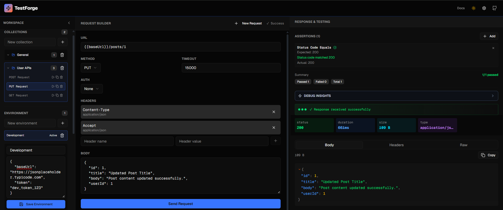
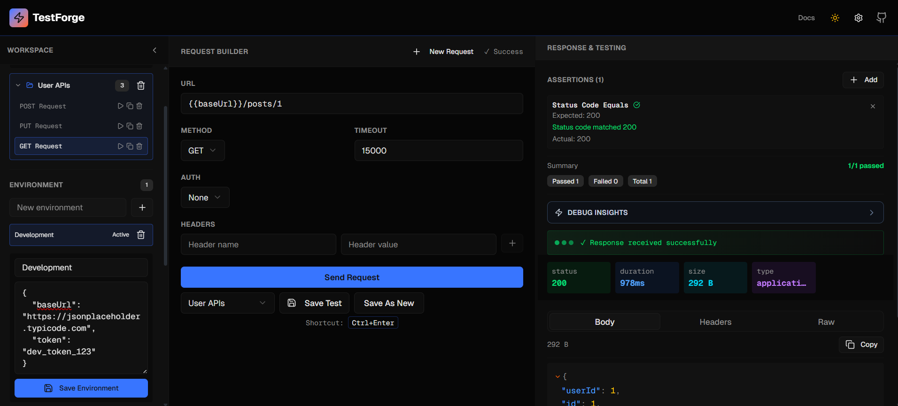
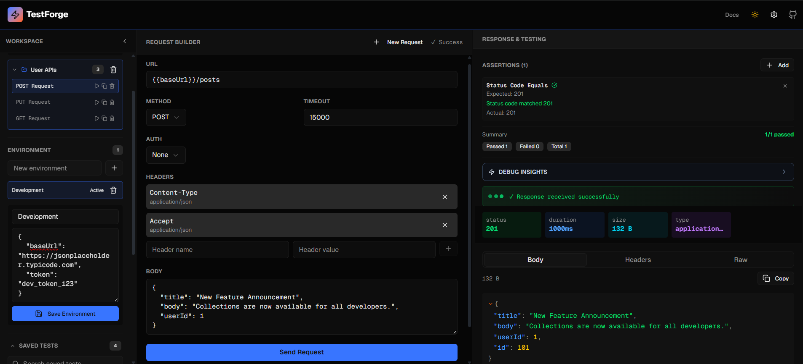
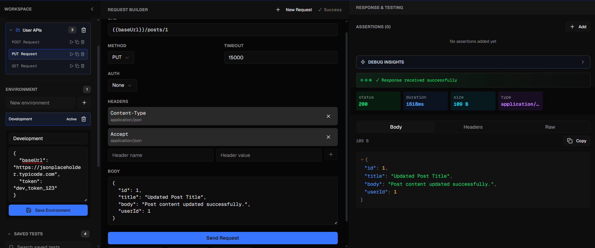
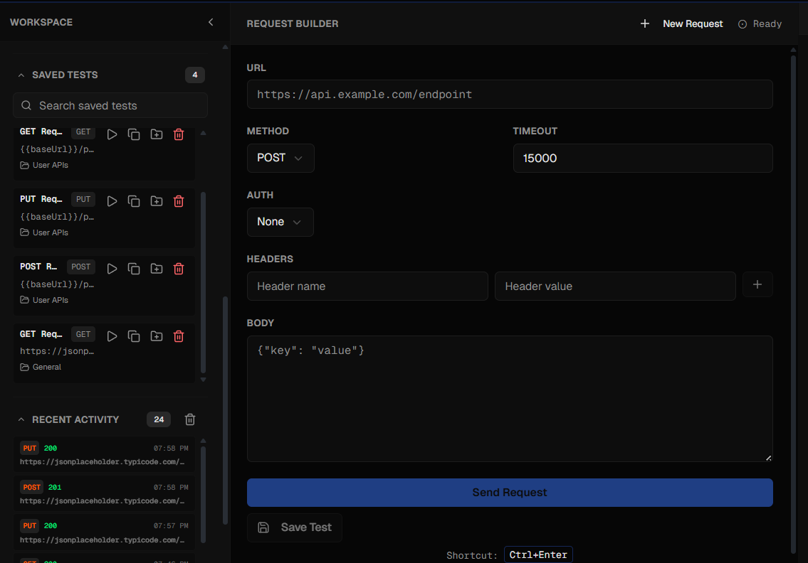
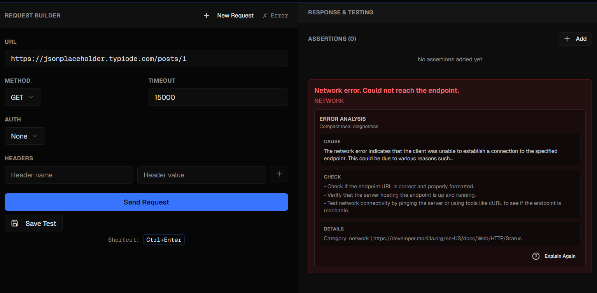
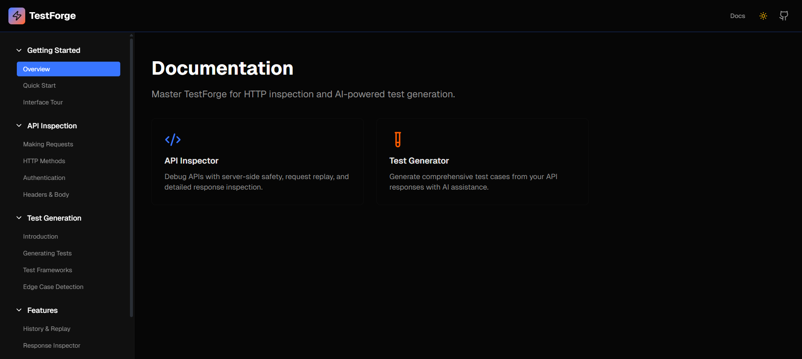

# TestForge

**Developer-focused API inspection and testing utility.**

A lightweight, self-contained HTTP request builder and response debugger. Send requests, inspect responses, manage history, and debug API behavior—no backend database, no auth complexity, no dependencies beyond React and Next.js.

---

## Overview

TestForge is a practical tool for developers who need to inspect, test, and debug HTTP APIs without the overhead of heavier platforms. It provides:

- **Server-side request execution** — All requests routed through a Next.js backend to avoid CORS issues and provide proper error categorization.
- **Request persistence** — Save up to 30 recent requests in localStorage for quick iteration and replay.
- **Response inspection** — View status codes, headers, timing, and formatted JSON responses.
- **Error clarity** — Automatic detection and explanation of common failures (timeouts, auth issues, rate limits, network errors).
- **Lightweight architecture** — No databases, no user accounts, no billing. Deploy and run locally or on any Node.js host.

**Philosophy:** Build tools for engineers, not dashboards for stakeholders. Focus on request/response clarity, local persistence, and zero setup overhead.

---

## Features

### Request Configuration
- URL entry with method selection (GET, POST, PUT, PATCH, DELETE, HEAD, OPTIONS)
- Headers editor with quick-add interface
- Request body editor for JSON payloads
- Authentication support (Bearer token, Basic auth)
- Custom timeout configuration per request
- Request cancellation at any time

### Response Analysis
- Live status code display with semantic coloring
- Response timing and payload size metrics
- Header inspection in dedicated tab
- Formatted JSON viewer with collapsible tree structure
- Syntax highlighting for readability
- Download option for large payloads (>500KB)

### Request Management
- Automatic history tracking (last 30 requests)
- Save/load requests with explicit naming
- Favorite requests for quick access
- One-click request replay
- Copy/export as production-ready cURL commands
- Search and filter history

### Error Diagnostics
- Automatic error categorization (timeout, CORS, auth, rate limit, network, parse)
- Context-aware suggestions for common failures
- Detailed error messages with actionable fixes
- Rate limit header detection and display

### Developer Experience
- Dark mode by default with light mode toggle
- Keyboard shortcuts: `Cmd/Ctrl+Enter` to send request
- Responsive design for desktop and mobile
- Zero setup required—just run and use
- Privacy-first: all data stays in localStorage

### Optional AI Assistance
- Error explanation and debugging suggestions via OpenAI API
- Request failure analysis with recommended fixes
- Only activates when `OPENAI_API_KEY` is configured
- Works perfectly fine without it—all core features function locally

---

## Screenshots

### Main Inspector Workspace


Full split-panel API inspection workspace with request builder, response viewer, assertions, collections, and environment management.

---

### GET Request Testing


Testing REST endpoints with saved collections, reusable environments, assertions, and formatted JSON response inspection.

---

### POST Request Workflow


Sending POST requests with JSON payloads, custom headers, response validation, and structured response analysis.

---

### PUT Request & Response Validation


Updating API resources with request body editing, status assertions, response metrics, and debug insights.

---

### Saved Requests & Recent Activity


Collection-based request management with replay support, request history tracking, and local persistence.

---

### AI Error Diagnostics


Automatic error categorization with contextual debugging assistance, suggested fixes, and AI-assisted explanations.

---

### Documentation System


Built-in documentation and onboarding system covering request workflows, testing features, debugging, and platform usage.

---

## Architecture

### Request Execution Flow

```
User Input (RequestBuilder)
    ↓
Next.js Frontend validates input
    ↓
POST /api/request (with config object)
    ↓
Backend: timeout wrapper + AbortController
    ↓
fetch() external API with proper headers/auth
    ↓
Catch errors → categorize by type
    ↓
Return { status, headers, body, timing, error }
    ↓
Frontend: parse JSON, render response
    ↓
Optionally: send to OpenAI for diagnostics (if OPENAI_API_KEY set)
```

### Key Design Patterns

#### Server-Side Proxy
All HTTP requests flow through `/api/request` instead of executing directly from the browser. This provides:
- **CORS elimination** — No browser origin restrictions
- **Timeout enforcement** — Server-side timeout control with AbortController
- **Error clarity** — Consistent error handling and categorization
- **Security** — Auth credentials never exposed to client

#### localStorage Persistence
Request history and saved tests are stored in browser localStorage:
- Maximum 30 items per collection (automatic eviction of oldest)
- Only request metadata stored (URL, method, headers, body, timestamp)
- Full response bodies not persisted (saves space)
- Survives page refreshes; cleared when localStorage is wiped

#### Error Categorization
Errors are classified into categories with suggested fixes:
```typescript
'timeout'   → Request exceeded time limit
'cors'      → Browser origin not allowed (shouldn't happen with proxy)
'auth'      → 401/403 status codes
'rateLimit' → 429 status or explicit headers
'network'   → Connection failed or DNS issues
'parse'     → Invalid JSON in response body
```

#### Lazy JSON Expansion
Large response bodies (>100KB) are rendered with a collapsible tree:
- Only expand sections when user clicks
- Prevents UI freeze on massive payloads
- >500KB responses show truncated preview with download link

### API Routes

| Route | Method | Purpose |
|-------|--------|---------|
| `/api/request` | POST | Execute HTTP request with timeout/cancellation |
| `/api/history` | GET | Retrieve stored request history |
| `/api/history` | DELETE | Clear history or remove specific requests |
| `/api/ai/explain` | POST | Get AI explanation of error (if OpenAI configured) |
| `/api/ai/suggest` | POST | Get suggested fixes from AI (if OpenAI configured) |

### Core Modules

| Module | Purpose |
|--------|---------|
| `lib/types.ts` | TypeScript definitions for requests, responses, errors |
| `lib/utils.ts` | Utility functions (JSON parsing, formatting) |
| `lib/error-categorizer.ts` | Error classification logic |
| `lib/curl-builder.ts` | Generate cURL commands from request config |
| `lib/request-history-manager.ts` | localStorage management |
| `components/RequestBuilder.tsx` | Request configuration form |
| `components/ResponseViewer.tsx` | Response display and state |
| `components/JSONViewer.tsx` | Collapsible JSON tree |
| `components/HistoryPanel.tsx` | Request history and search |

---

## Tech Stack

| Category | Technology |
|----------|------------|
| **Framework** | Next.js 16 (App Router) |
| **Language** | TypeScript 5.7 |
| **React** | React 19 |
| **Styling** | Tailwind CSS 4.2 |
| **Components** | shadcn/ui (Radix UI based) |
| **Icons** | Lucide Icons |
| **Forms** | React Hook Form + Zod validation |
| **Charts** | Recharts 2.15 (for metrics) |
| **Storage** | Browser localStorage |
| **HTTP** | Native fetch API |
| **Deployment** | Vercel Analytics ready |

---

## Request Flow Example

### GET Request

```http
GET https://api.github.com/users/octocat
Authorization: Bearer <github-token>
Accept: application/json
```

**Response:**
```json
{
  "status": 200,
  "headers": {
    "content-type": "application/json; charset=utf-8",
    "x-ratelimit-remaining": "59",
    "x-ratelimit-reset": "1234567890"
  },
  "body": {
    "login": "octocat",
    "id": 1,
    "name": "The Octocat",
    "public_repos": 2
  },
  "timing": 145,
  "size": 1024
}
```

### POST Request with Body

```http
POST https://jsonplaceholder.typicode.com/posts
Content-Type: application/json

{
  "title": "New Post",
  "body": "This is a test post",
  "userId": 1
}
```

**Response:**
```json
{
  "status": 201,
  "headers": {
    "content-type": "application/json"
  },
  "body": {
    "id": 101,
    "title": "New Post",
    "body": "This is a test post",
    "userId": 1
  },
  "timing": 234,
  "size": 256
}
```

### Error Response (Rate Limited)

```http
GET https://api.twitter.com/2/tweets/12345
Authorization: Bearer <token>
```

**Error Detection:**
```json
{
  "status": 429,
  "error": {
    "category": "rateLimit",
    "message": "Too Many Requests",
    "suggestion": "Rate limit exceeded. Check X-RateLimit-Reset header for retry time.",
    "headers": {
      "x-ratelimit-remaining": "0",
      "x-ratelimit-reset": "1234567890"
    }
  }
}
```

---

## Environment Variables

TestForge works completely without configuration, but supports optional AI diagnostics:

```bash
# Optional: Enable AI-assisted error explanations and suggestions
OPENAI_API_KEY=sk_...

# Optional: Set custom OpenAI model (defaults to gpt-4o-mini)
OPENAI_MODEL=gpt-4-turbo
```

**Important:**
- `OPENAI_API_KEY` is **completely optional**
- All core features (request building, history, error categorization) function without it
- Local error detection and suggestions work offline
- AI features only enhance diagnostics when the key is provided

---

## Local Development

### Prerequisites
- Node.js 18+
- pnpm (or npm/yarn)

### Installation

```bash
# Clone repository
git clone https://github.com/VishalGhuge111/TestForge.git
cd testforge

# Install dependencies
pnpm install

# Or with npm
npm install
```

### Development Server

```bash
pnpm dev
# or: npm run dev

# Open http://localhost:3000
```

Hot module reloading enabled. Edits to `app/` or `components/` reflect instantly in the browser.

### Production Build

```bash
pnpm build
pnpm start
```

Built with Next.js static generation and bundle optimization.

### Linting

```bash
npm run lint
```

---

## Folder Structure

```
testforge/
├── app/
│   ├── layout.tsx                   # Root layout
│   ├── page.tsx                     # Main inspector page
│   ├── globals.css
│   ├── api/
│   │   ├── request/route.ts         # POST /api/request
│   │   ├── history/route.ts         # GET/DELETE /api/history
│   │   └── ai/
│   │       ├── explain/route.ts
│   │       └── suggest/route.ts
│   └── docs/page.tsx
│
├── components/
│   ├── RequestBuilder.tsx           # Request form
│   ├── ResponseViewer.tsx           # Response display
│   ├── JSONViewer.tsx               # JSON tree
│   ├── HistoryPanel.tsx             # Request history
│   └── ai-insights/
│       ├── AIInsights.tsx
│       ├── ExplainErrorButton.tsx
│       └── AISettings.tsx
│
├── lib/
│   ├── types.ts
│   ├── utils.ts
│   ├── error-categorizer.ts
│   ├── curl-builder.ts
│   ├── request-history-manager.ts
│   └── validation.ts
│
├── public/
├── package.json
├── tsconfig.json
└── README.md
```

---

## Engineering Decisions

### 1. Server-Side Request Proxy
**Decision:** All external API requests execute through `/api/request` on the backend instead of direct browser fetch.

**Why:**
- Eliminates CORS errors
- Enforces timeout/cancellation server-side
- Matches real production architecture

**Tradeoff:** One extra network hop (negligible for API debugging).

### 2. No Backend Database
**Decision:** Use browser localStorage only; no server-side persistence.

**Why:**
- Zero infrastructure to deploy
- Works offline
- Privacy-first; data never leaves the device

**Constraint:** Single device; 30-request limit per collection.

### 3. Optional AI Diagnostics
**Decision:** AI explanations only activate when `OPENAI_API_KEY` is configured.

**Why:**
- Core tool works without any API key
- No vendor lock-in
- AI is enhancement, not requirement

**Tradeoff:** Advanced diagnostics need external API.

### 4. No Authentication System
**Decision:** Zero user accounts; local-only storage.

**Why:**
- No signup/login friction
- Smaller codebase
- Privacy by default

**Constraint:** Single device; no team workspaces.

### 5. Lazy JSON Expansion
**Decision:** Only expand JSON sections when user clicks; collapsible tree for large responses.

**Why:**
- Handles massive payloads without UI freeze
- Developer controls inspection depth
- Reduces initial render time

**Tradeoff:** Slight delay on first expansion.

---

## Future Improvements

- **Import/Export Collections** — Save and share request collections as JSON
- **HAR Format Support** — Import/export .har files for tooling interop
- **Team Workspaces** — Cloud sync for shared collections (optional)
- **Advanced Assertions** — Chainable assertion evaluation
- **Request Tabs** — Multiple concurrent requests
- **GraphQL Support** — Query builder with schema introspection
- **Webhook Debugging** — Local endpoint for incoming webhooks
- **Performance Profiling** — Request phase timing breakdown

---

## License

MIT License. See [LICENSE](LICENSE) for full text.

---

## Contributing

Feedback and bug reports welcome. Open an issue to discuss improvements or report problems.
